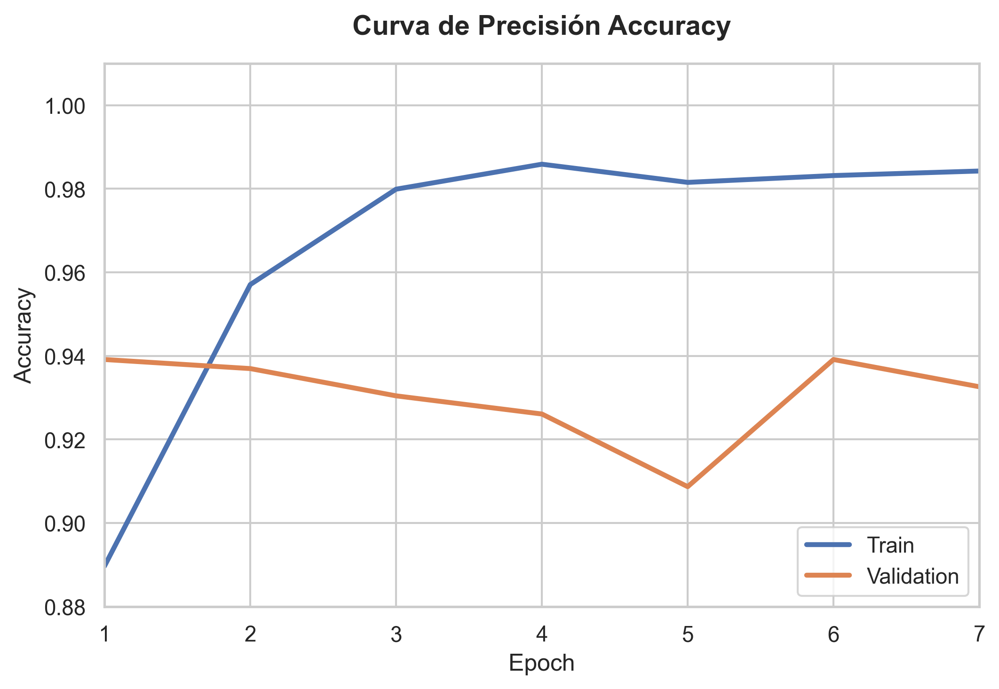

# Clasificación Automática de Daños Vehiculares mediante Deep Learning

## 1. Definición del Problema
En la industria automotriz y de seguros, la evaluación manual de daños en vehículos tras un siniestro es un proceso costoso, propenso a errores humanos y lento. Este proyecto aborda este problema, respondiendo a la pregunta: *¿Es posible clasificar de forma automática y precisa si un vehículo ha sufrido daños estructurales a partir de una fotografía?* Desarrollar una solución automatizada optimiza los tiempos de respuesta para los seguros y mejora la transparencia del servicio para los usuarios.

## 2. Breve Descripción del Dataset y Fuente
El dataset (rescatado dsde Kaggle llamado Car damage detection de Anuj Shah) utilizado contiene imágenes de vehículos divididas de forma equitativa en dos categorías: `00-damage` (autos dañados/chocados) y `01-whole` (autos sanos/completos). El volumen de datos se distribuye de la siguiente manera tras el análisis exploratorio (EDA):

| Conjunto | Autos Dañados (`00-damage`) | Autos Sanos (`01-whole`) | Total por Conjunto |
| :--- | :---: | :---: | :---: |
| **Entrenamiento (Train)** | 920 | 920 | **1.840** |
| **Validación (Val)** | 230 | 230 | **460** |
| **Total General** | **1.150** | **1.150** | **2.300** |

*Nota del EDA:* Se constató que las imágenes originales cuentan con resoluciones promedio de 267x190 píxeles, con dimensiones mínimas de 168x161 y máximas de 313x299. Esto justificó técnicamente el redimensionamiento a 256x256 y un recorte central de 224x224 para estandarizar la entrada de la red sin deformar los patrones estructurales del auto. El dataset se encuentra perfectamente balanceado (50% por clase), eliminando sesgos en el entrenamiento.

## 3. Justificación del Modelo Seleccionado
Se seleccionó la arquitectura **ResNet50** preentrenada con el dataset `IMAGENET1K_V1`. Las razones técnicas de su elección son:
* **Conexiones residuales (Skip Connections):** Permiten entrenar redes profundas evitando la degradación del gradiente.
* **Transfer Learning:** Aprovecha características visuales complejas (bordes, texturas, formas geométricas) ya aprendidas en millones de imágenes, acelerando la convergencia para nuestra tarea específica de detectar deformaciones en carrocerías.
* **Eficiencia:** Logra un equilibrio óptimo entre costo computacional y precisión en comparación con modelos más pesados.

## 4. Metodología Aplicada (Paso a Paso)
1. **Análisis Exploratorio de Datos (EDA):** Verificación del balance de clases, inspección visual de muestras de ambas categorías y análisis estadístico de resoluciones e intensidad de canales de color.
2. **Procesamiento y Aumento de Datos (Regularización):** Se aplicaron transformaciones de redimensionamiento y normalización de ImageNet. Para combatir el sobreajuste (overfitting), se implementó aumento de datos mediante rotaciones aleatorias (`15°`) y giros horizontales (`RandomHorizontalFlip`).
3. **Modificación de la Arquitectura:** Se congelaron los pesos de las primeras capas y se sustituyó la capa final (`model.fc`) por un bloque secuencial compuesto por `nn.Dropout(0.5)` y una capa lineal adaptada a nuestras 2 clases objetivo.
4. **Fine-Tuning Parcial:** Se desbloquearon los parámetros de la última etapa convolucional (`model.layer4`) y de la nueva capa lineal para ajustar los filtros específicos a texturas de choques y abolladuras.
5. **Optimización:** Uso del optimizador `AdamW` con una tasa de aprendizaje baja ($lr = 0.0001$) y penalización de pesos (`weight_decay = 0.01`). La función de pérdida empleada fue `CrossEntropyLoss`.
6. **Entrenamiento y Control:** Bucle de 30 épocas monitorizado con **Early Stopping** (paciencia de 6 épocas) basado en el rendimiento del conjunto de validación.

## 5. Resultados Obtenidos
El proceso de optimización fue controlado mediante *Early Stopping*, deteniendo el entrenamiento de manera anticipada en la **época 7** al notar una tendencia al estancamiento en la pérdida de validación, protegiendo así al modelo contra el sobreajuste (overfitting). El mejor estado de la red fue guardado automáticamente en la **época 1**, alcanzando una exactitud de validación inicial del 93.91%.

A continuación, se visualiza la evolución del rendimiento:

### Análisis Crítico del Rendimiento:
* **Convergencia Inmediata:** Al utilizar los pesos preentrenados de ResNet50 (*Transfer Learning*), el modelo demostró una velocidad de adaptación tremenda, logrando su punto óptimo de generalización casi de inmediato (Época 1).
* **Comportamiento del Overfitting:** A partir de la época 2, mientras la curva de entrenamiento (`Train`) continuaba subiendo progresivamente hacia el 98%, la precisión de validación empezó a oscilar ligeramente a la baja. La paciencia configurada intervino con éxito deteniendo el proceso a tiempo en la época 7.

### Evaluación en el Conjunto de Validación:
Al evaluar el mejor modelo consolidado frente a las 460 imágenes de validación, se obtuvieron las siguientes métricas:
| Clase | Precision | Recall | F1-Score | Support |
| :--- | :---: | :---: | :---: | :---: |
| **00-damage** | 0.90 | 0.99 | 0.94 | 230 |
| **01-whole** | 0.99 | 0.89 | 0.94 | 230 |
| | | | | |
| **Accuracy** | | | **0.94** | **460** |
| **Macro Avg** | 0.94 | 0.94 | 0.94 | 460 |
| **Weighted Avg** | 0.94 | 0.94 | 0.94 | 460 |

## 6. Conclusiones
* El uso de *Transfer Learning* junto con un *Fine-Tuning* enfocado en la etapa final (`layer4`) demostró ser una estrategia sumamente efectiva, logrando un 94% de exactitud general con un tiempo de cómputo e iteración mínimos.
* Las técnicas de regularización aplicadas (`Dropout` al 50%, `Weight Decay` en AdamW y el aumento de datos mediante rotaciones y reflejos) funcionaron en perfecta sincronía con la herramienta de *Early Stopping*, frenando el bucle antes de que la red memorizara por completo el set de entrenamiento y perdiera capacidad de generalización.
* El modelo es altamente confiable para tareas de pre-evaluación en entornos reales, logrando diferenciar cambios estructurales complejos en las carrocerías y garantizar que prácticamente ningún vehículo dañado sea clasificado erróneamente como sano (99% de Recall).
